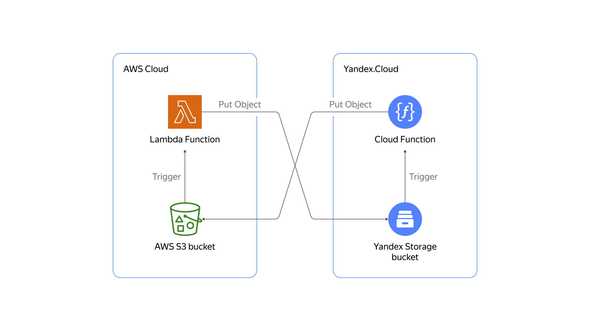

# Описание

Этот сценарий объясняет, как использовать функции [AWS Lambda](https://aws.amazon.com/lambda/) и [Yandex Cloud Functions](https://yandex.cloud/docs/functions/) для синхронизации новых объектов в [AWS S3](https://aws.amazon.com/s3/) и [Yandex Object Storage](https://yandex.cloud/docs/storage/).

В примере используется одинаковый код функции для обеих платформ, так как среды выполнения Yandex Cloud Functions и AWS Lambda совместимы.

Из кода видно, что для обеих платформ используется одинаковый S3 API, поскольку AWS S3 API и Yandex Object Storage API также совместимы.


<p align="center">
    
</p>

# Ограничения

Обратите внимание, что в этом примере синхронизация происходит только для новых объектов. Если вам необходимо решение, которое охватывает больше готовых сценариев, см. <a href="../Multi-cloud S3 storage/README.md">руководство по многооблачному хранилищу с Yandex Cloud и Amazon S3</a>.


# Синхронизация двух бакетов S3

В примере ниже показано, как работает синхронизация.
Для данного сценария понадобится следующее:

- Аккаунты в AWS и Yandex Cloud.
- Оболочка Bash.
- Terraform версии 1.1.5.
- [s3cmd](https://s3tools.org/download)
- Утилитa `jq`.

Настройте инфраструктуру AWS:
- Настройте [AWS CLI](https://docs.aws.amazon.com/cli/latest/userguide/cli-chap-configure.html).


Настройте инфраструктуру Yandex Cloud:
- Настройте [YC CLI](https://yandex.cloud/docs/cli/quickstart). 
- Подготовьте окружение в Terraform:

```
export YC_TOKEN=$(yc iam create-token)
export YC_CLOUD_ID=$(yc config get cloud-id)
export YC_FOLDER_ID=$(yc config get folder-id)
export TF_VAR_folder_id=$YC_FOLDER_ID
```


## Начало работы

### Запустите демонстрационный сценарий  

```
cd example
terraform init
terraform apply
```

### Проверьте результаты

Для проверки понадобятся следующие инструменты:
- `aws` для инфраструктуры AWS.
- `s3cmd` для инфраструктуры Yandex Cloud.

Подготовьте окружение:
```
BUCKET_NAME=$(terraform output -raw bucket_name)
mv s3cfg ~/.s3cfg
```

Убедитесь, что бакеты AWS и Yandex Cloud не содержат объектов:
```
aws s3 ls $BUCKET_NAME
s3cmd ls s3://$BUCKET_NAME
```

Поместите файл в бакет Yandex Cloud:
```
s3cmd put sync.zip s3://$BUCKET_NAME 

upload: 'sync.zip' -> 's3://yc-s3-sync-a6v4g3vlra/sync.zip'  [1 of 1]
 2551 of 2551   100% in    0s    24.73 KB/s  done
```

Убедитесь, что файл доступен в Yandex Cloud:
```
s3cmd ls s3://$BUCKET_NAME

2020-12-08 18:41         2551  s3://yc-s3-sync-a6v4g3vlra/sync.zip
```

Убедитесь, что файл был успешно синхронизирован с AWS S3:
```
aws s3 ls $BUCKET_NAME

2020-12-08 21:42:14       2551 sync.zip
```

### Выполните быстрое удаление созданных ресурсов

Удалите все файлы из бакетов AWS и Yandex Cloud:
```
aws s3 rm s3://$BUCKET_NAME/sync.zip
s3cmd rm s3://$BUCKET_NAME/sync.zip
rm ~/.s3cfg
```

Удалите ресурсы Terraform:
```
terraform destroy
```
